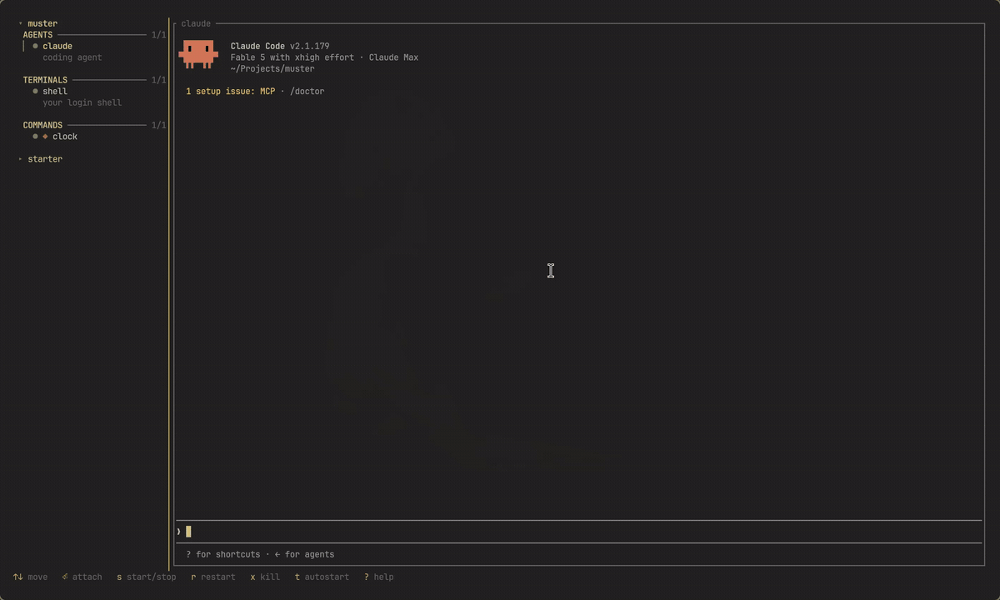

# muster

A terminal workspace for running CLI agents and dev processes side by side.

muster runs your agents, dev servers, log tails, and build watchers as panes in a
single terminal and manages their lifecycle: start, stop, restart, and
auto-restart on failure.

**Status: Beta**

It's been my daily driver for running local work for a while. This is the
cleaned-up cut I opened up, done with help of the AI.

## Demo



## Features

- Runs each process under its own PTY and renders it live. A process that exits
  keeps its last screen.
- Full lifecycle control: start/stop, restart, force-kill, pause/resume
  (SIGSTOP/SIGCONT), command-level graceful shutdown, and auto-restart on
  failure.
- A projects tree in the sidebar for switching between workspaces.
- Live config reload: edits are reconciled into the running workspace, adding new
  processes and dropping removed ones while leaving running ones untouched.
- First-class agent sessions can be launched from presets, named automatically,
  closed into history, resumed, and restored with their workspace. Terminals and
  commands can be added persistently without leaving the app.
- A failed process raises an alert visible from any pane.

## Getting started

Requires a recent Rust toolchain.

```sh
cargo install muster-workspace
muster                       # starts the TUI on a local or registered workspace
muster hooks setup           # enables native session discovery for agent CLIs
```

From a source checkout:

```sh
cargo run                     # starts the TUI on ./muster.yml
cargo run -- --config my.yml  # use a different config
```

Without `--config`, muster uses `$MUSTER_PROJECT` when launched from one of its
panes, then `./muster.yml` when present, then the first project in the global
registry. This means a registered workspace can be launched from any directory.
Registry config paths are stored as absolute paths. Legacy relative entries are
not supported during beta because resolving them from another directory is
unsafe. Convert or remove them directly in the global `projects.yml` registry.

Press `?` in the app for the full keymap:

- `j`/`k` or arrows to move, `Enter`/`l` to open, `h` to go back
- `s` start/stop, `r` restart, `p` pause, `x` force-kill, `t` toggle autostart
- `a` add a process, `n` new project, `o` switch projects
- `d` closes an agent session into history or removes the selected saved project
- `u` reopens the most recently closed agent session
- `C-a` detaches from a focused pane; the same commands work as `C-a` chords while
  attached
- `q` to quit

## Configuration

A workspace is a YAML file with three sections: `agents`, `terminals`, and
`commands`. The grouping controls how processes appear in the sidebar. Commands
can additionally opt into graceful shutdown.

```yaml
agents:
  - name: claude
    command: claude
    description: coding agent
    autostart: false

terminals:
  - name: shell
    command: null          # null runs your login shell
    description: your login shell

commands:
  - name: clock
    command: while true; do date +%T; sleep 1; done
    restart: on_failure
    stop:
      signal: terminate
      grace_period: 5s
    autostart: false
```

Entries under `agents` are pinned workspace processes. They persist in
`muster.yml` and use the normal start, stop, restart, and autostart controls.

Press `a`, choose `agent`, then select Claude, Codex, Gemini, Amp, OpenCode,
Copilot, Kimi, or Custom to launch a first-class agent session. `Enter` launches
a known preset immediately with a generated human name; `e` opens the advanced
form for a custom name, command, and resume command. Sessions never modify
`muster.yml`. Closing one with `d` or `C-a d` moves it into history, and `u`
resumes the latest closed conversation. Open resumable sessions return when the
workspace is opened again. If a provider ID was not captured, the session
returns as a stopped row so `d` can close it without starting a new conversation.

Run `muster hooks setup` once to install the provider lifecycle integrations
that capture native conversation IDs. Setup is explicit and idempotent, and
OpenCode's plugin is installed under its XDG configuration root. Provider
conversation switches update the durable resume target. OpenCode captures only
the active top-level conversation, ignoring child and background session
metadata. Caller-assigned IDs are not treated as resumable until the provider
confirms them. Muster also exposes a versioned
[agent event protocol](docs/agent-protocol.md) so new agents can integrate
without screen scraping or a Rust dependency.

Agent activity detection follows the selected tool. Codex, Gemini, and Amp use
terminal-title changes; the other presets use visible output. Terminal progress,
bells, and notification sequences still provide explicit working or waiting
signals for every preset.

The left dot always shows process lifecycle. A working agent also gets a cyan
animated marker at the right edge, while any process that explicitly requests
attention gets a yellow `!`. Ordinary command and terminal output adds no second
marker.

- `autostart`: `null` uses the default (agents and terminals start with the
  workspace, commands wait for `s`), or set `true`/`false` explicitly. Toggle it
  live with `t`.
- `restart`: `never`, `on_failure`, `always`, or `null` to never restart.
- `working_dir`: launch directory; inherits the workspace directory when `null`.
- `stop`: optional and valid only on commands. Commands default to `terminate`
  (SIGTERM) with a `5s` grace period. Set both `signal` (`terminate` or
  `interrupt`) and a human-readable `grace_period` such as `5s` or `1m` to
  override that policy.

For commands, `s` and `r` send the effective graceful signal to the whole process
group, wait for its grace period, then use SIGKILL if it is still alive. `x`
always force-kills the selected process immediately. Agents, terminals, project
switches, and quitting always use immediate kill.

## muster run

`muster run` registers a command into a project and runs it in place, without
opening the config:

```sh
muster run -- npm run dev
muster run --name api --kind terminal -- cargo watch -x run
```

The target is `--project` if given, otherwise `$MUSTER_PROJECT` (exported into
every pane), otherwise `--config`. Shell quoting is preserved and `--project` has
tab completion.
