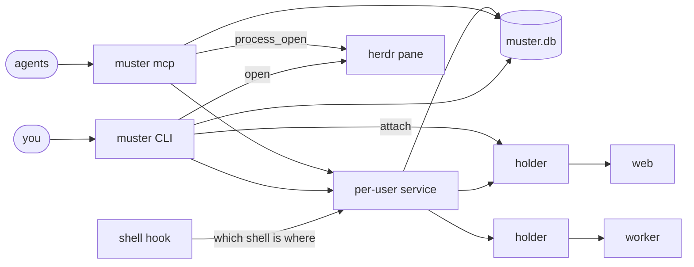

# muster

muster runs your project's dev processes (servers, workers, watchers) in the
background, so they keep running whichever terminal you close. You and your
coding agents drive the same stack: you from the CLI, agents over MCP. muster
draws no panes. `muster attach` shows a process in the terminal you are already
in, and inside [herdr](https://herdr.dev) `muster open` puts it in a pane next
to yours.

Beta. Linux and macOS.

## Install

You need a recent Rust toolchain.

```sh
cargo install muster-workspace
```

There is no daemon to set up. The first command that needs the background
service starts it.

## Quickstart

```sh
cd ~/code/shop
muster add web --autostart --port 5173 -- npm run dev   # registers the folder as a project
muster add worker --autostart -- bin/worker
muster up              # start the autostart processes
muster ps              # state, readiness, ports, pid, uptime, restarts, usage
muster logs web -f     # follow the log, across restarts
muster attach web      # see its screen and type into it; ctrl-\ detaches
```

`muster init` can read `package.json`, `Procfile`, `justfile`, `Makefile` and
compose files and offer the commands it finds. Bare `muster` is `muster ps`.

## What you get

- Processes that outlive the service. Each one runs under its own small holder
  process, so stopping, crashing or upgrading muster leaves them running, and
  the next service picks them back up with their screens intact.
- Restart policies (`never`, `on-failure`, `always`) with backoff, a stop
  signal and grace period per process, and pause/resume.
- Readiness checks: a log line, an open port or an HTTP answer on localhost.
  `muster start --wait` and `muster wait` block until a process is ready, prints
  a line, or reaches a state.
- Logs kept across restarts and after exit, with rotation, `--grep`, `--errors`
  (error lines with their stack traces) and cursors, so you can read only what
  is new since the last look. `muster logs --screen` prints what the terminal
  shows right now.
- Declared ports. A start is refused when something already holds one of the
  process's ports, and muster tells you who holds it and how to free it.
- A shell hook. With `eval "$(muster shell-init bash)"` (or zsh, or fish) in
  your rc file, entering a project's folder starts its autostart processes, and
  once no shell has been in the project for `idle-stop` (30 minutes by
  default) it stops them. The prompt never waits on muster.
- `muster export` writes the stack to a `muster.yml` you can commit, and
  `muster import` loads it into another checkout. Environment values stay out
  unless you ask for them. See [examples/muster.yml](examples/muster.yml).
- `--json` on almost every command, and stable exit codes, for scripts.
- `muster doctor` checks the database, the projects, the shell hook,
  completions and the terminal workspace.

## For agents (MCP)

```sh
muster mcp --print-config   # the snippet to add to your agent's MCP servers
```

One entry serves every project. Over MCP an agent can:

- see the stack: what runs, readiness, ports, URLs, how each process last
  exited, and a stream of lifecycle events it can long-poll;
- start, stop and restart processes, and wait until they are ready, print a
  line or answer on a port;
- read logs (only errors, or only what is new since a cursor) and the current
  screen, and send input;
- add, change and remove processes, within guardrails: you can make MCP
  read-only with `muster config set mcp-stack-edits read-only`, every agent
  edit shows up in `muster notices`, and a working directory has to stay
  inside the project;
- coordinate with other agents through shared notes, todos, key-value state
  and locks on the project;
- open a process in a new herdr pane beside its own, without taking focus.

Crashes and readiness timeouts ride along on every result as `alerts`, so an
agent hears about a crash without polling. Stopping the whole stack is left to
you at the CLI.

## herdr

From a herdr pane, `muster open web` splits a new pane, focuses it and attaches
to `web`. Detaching closes the pane. Without `--direction right|down` it
splits to the right when the pane is wider than tall and each half keeps at
least 40 columns, and downward otherwise. If herdr cannot be reached, `open`
fails with herdr's message and points you at `muster attach`; over MCP,
`process_open` answers `workspace-failed`. Outside herdr, `muster open` is
`muster attach`.

## How it works


```mermaid
flowchart LR
    you([you]) --> cli[muster CLI]
    agent([agents]) --> mcp[muster mcp]
    hook[shell hook] -- "which shell is where" --> svc
    cli --> svc[per-user service]
    mcp --> svc
    cli --> db[(muster.db)]
    mcp --> db
    svc --> db
    svc --> h1[holder] --> p1[web]
    svc --> h2[holder] --> p2[worker]
    cli -- "attach" --> h1
    cli -- "open" --> herdr[herdr pane]
    mcp -- "process_open" --> herdr
```

There is one background service per user. It owns a supervisor for each
loaded project, applies restart policies, runs readiness checks and keeps the
event stream. The processes themselves run under holders: one detached muster
process per child, which owns that child's PTY, terminal
emulator and log, and keeps serving until a supervisor has collected the
child's exit. The service talks to
holders over Unix sockets, so it can stop or crash or be upgraded, and the next
one reconnects to every holder and carries on.

Everything muster stores sits in one SQLite file, `muster.db` in the state
directory: each project's stack, the machine's settings, the agents' notes,
todos and locks, and how each process last ended. The CLI and the MCP server
write stack edits there directly and then tell the service what changed, so
editing works even when the service is down. `attach` connects your terminal
straight to the holder's screen, and `open` asks herdr for a pane that runs
`attach`.

Inside, the code is hexagonal. A pure `domain` with no I/O defines the ports,
`application` holds the use cases, and everything concrete (CLI, MCP, service,
holder, PTY, SQLite) is an adapter wired together in `main.rs`.

## Reference

Every command, setting, exit code, the JSON conventions, the stack file format
and the full MCP tool list are in [docs/reference.md](docs/reference.md).

## License

MIT
